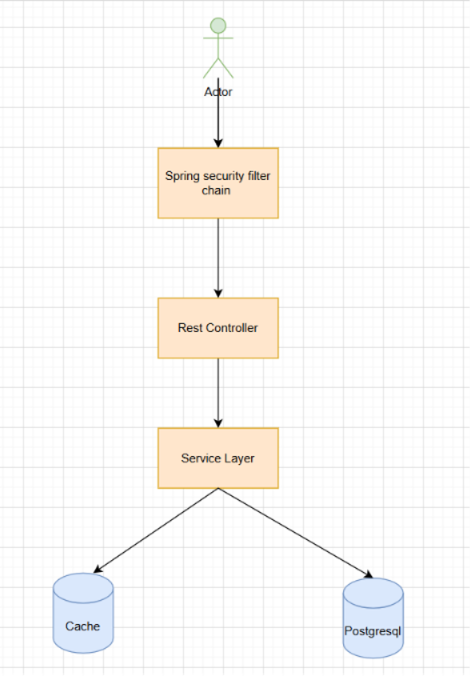
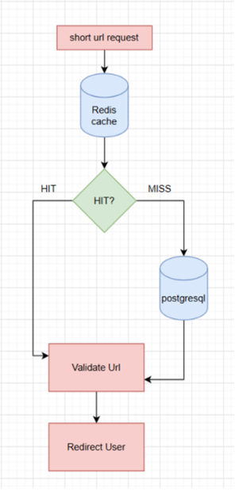
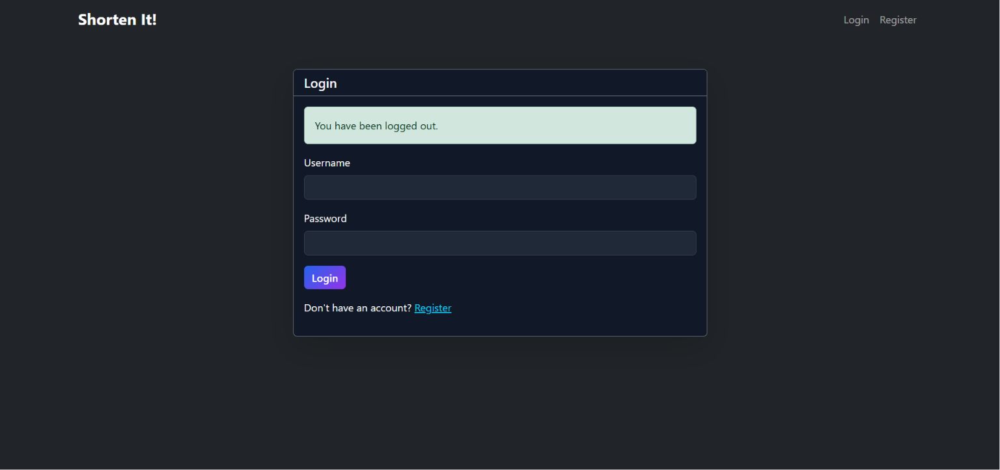
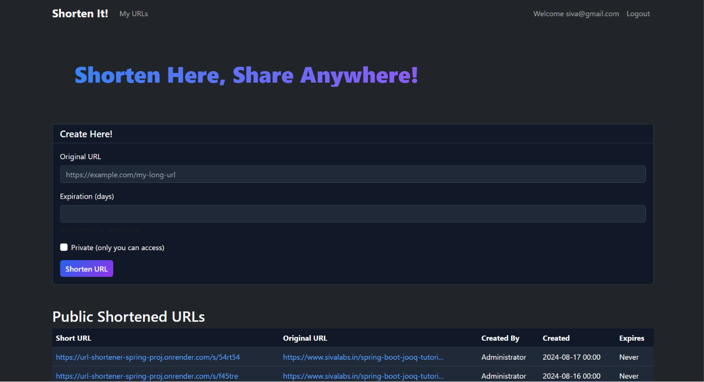
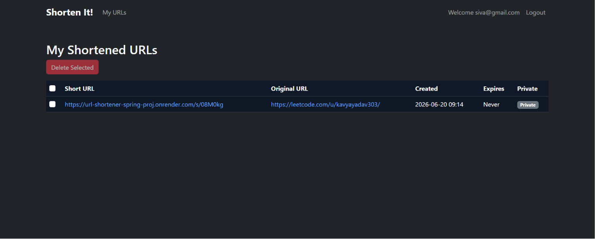

# URL Shortener

Production-oriented URL shortening platform built using Spring Boot and Redis, designed for low-latency redirects, efficient short URL generation, and abuse protection.
## Live Demo

Application: https://url-shortener-spring-proj.onrender.com/

> **Note:** Hosted on Render's free tier. The initial request may experience a delay of up to 2–4 minutes due to cold starts.

### Demo User:
Email: siva@example.com

Password: secret

Users can register and test the application directly.
## Features

- Session-based authentication and authorization using Spring Security
- Create and manage shortened URLs
- Public and private URL support
- URL expiration handling
- Base62 encoded short URLs
- Redis cache-aside pattern for faster redirects
- Redis-backed rate limiting
- Collision-free short URL generation using range-based ID allocation
- Centralized exception handling and validation
- Flyway database migrations
- Docker-based local development setup
- ## System Architecture

### Authentication & Security Flow

<p align="center">
  
</p>

This diagram illustrates the authentication flow, request processing pipeline, and security mechanisms implemented using Spring Security.

### URL Processing Flow

<p align="center">
  
</p>

This flow diagram describes the end-to-end lifecycle of a shortened URL, including generation, caching, database access, validation, and redirection.

---

## Application Screenshots

### Login Page

<p align="center">
  
</p>

### Dashboard

<p align="center">
  
</p>

### My URLs

<p align="center">
  
</p>
- ## Short URL Generation

Instead of generating random keys and repeatedly checking the database for collisions, the system uses a range-based ID allocation strategy.

1. A counter in PostgreSQL tracks the next available ID.
2. The application reserves a batch of IDs in memory.
3. New URLs consume IDs from the reserved range.
4. The counter is periodically synchronized back to PostgreSQL.
5. Numeric IDs are converted to compact Base62 strings.

This approach eliminates database lookups during URL creation and reduces contention under load.
## Redirect Flow

When a user accesses a short URL:

1. Redis is checked for the original URL.
2. If found, the user is redirected immediately.
3. Otherwise, PostgreSQL is queried.
4. The URL is validated (expiration/access checks).
5. Redis is updated.
6. The user is redirected.
7. ## Rate Limiting

Redis-backed rate limiting protects authentication and URL creation endpoints.

Requests exceeding configured thresholds receive HTTP 429 (Too Many Requests), helping prevent abuse and accidental misuse.
## API Endpoints

### Authentication
- `POST /register` – Register a new user account.
- `POST /login` – Authenticate an existing user.
- `POST /logout` – End the current user session.

### URL Management
- `POST /short-urls` – Create a new shortened URL.
- `GET /my-urls` – Retrieve all URLs created by the authenticated user.
- `POST /delete-urls` – Delete an existing shortened URL.

### Redirect
- `GET /s/{shortKey}` – Redirect users to the original URL associated with the short key.

---

## Running Locally

1. **Clone the repository**
   ```bash
   git clone https://github.com/your-username/url-shortener.git
   cd url-shortener
   ```

2. **Start the required services using Docker**
   ```bash
   docker compose up -d
   ```

3. **Run the Spring Boot application**
   ```bash
   ./mvnw spring-boot:run
   ```

4. **Access the application**
   - Open your browser and navigate to:
     ```
     http://localhost:8080
     ```
     
## Tech Stack

| Category | Technologies |
|----------|--------------|
| Backend | Spring Boot |
| Security | Spring Security |
| Database | PostgreSQL |
| Caching | Redis |
| Migrations | Flyway |
| ORM | JPA / Hibernate |
| Containerization | Docker |
| Build Tool | Maven |
## Future Improvements

- Analytics dashboard
- Distributed ID allocation across multiple instances
- Token bucket rate limiting
- Monitoring and observability
- CI/CD pipeline integration
